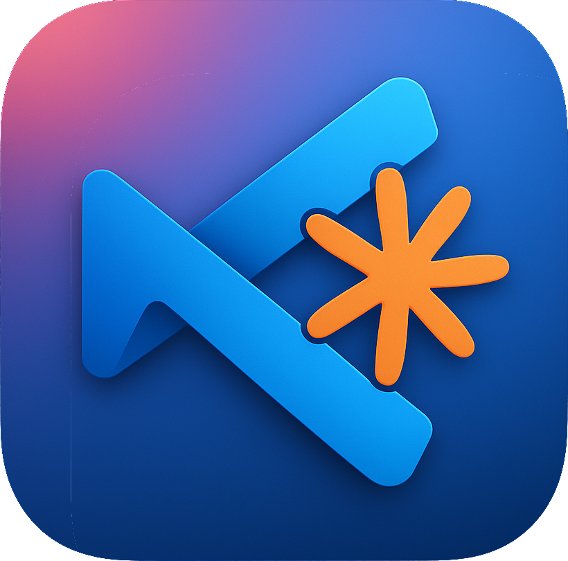

<p align="center">
  
</p>

# VS Claude

A VS Code extension that enables Claude Code (or any other MCP-enabled tool) to control Visual Studio Code through the Model Context Protocol (MCP). This allows Claude to open files, navigate to specific lines, and create diff views directly in your VS Code editor.

## What is VS Claude?

VS Claude acts as a bridge between Claude and your VS Code editor. When you're chatting with Claude about code, Claude can:
- **Open specific files in your VS Code editor**
  - "Open the main.go file in VS Code"
  - "Show me the package.json file in VS Code"
- **Highlight code ranges**
  - "Show me the main loop in glfw-example.cpp in VS Code"
  - "Find where we write to the channel file and highlight it in VS Code"
  - "Highlight all usages of the updatePhysics method in Skeleton.cs in VS Code"
  - "Show me all the error handling blocks in main.py in VS Code"
- **Show diffs between files**
  - "Compare old.js with new.js in VS Code"
  - "Show me the diff between config.json and config.backup.json in VS Code"
- **Show git diffs**
  - "Show me the git diff for Animation.java between branches 4.2 and 4.3-beta in VS Code"
  - "Show me git diff for State.ts, working vs last commit in VS Code"
  - "Show me what changed in main.py in the last commit in VS Code"
  - "Show the staged changes for UserService.java in VS Code"
- **Navigate to symbols and functions**
  - "Find the handleRequest function in VS Code"
  - "Go to the definition of the UserService class in VS Code"
- **Work with multiple VS Code windows**
  - Claude will automatically detect and let you choose which window to use

## Installation

### From VS Code Marketplace (Recommended)

1. Open VS Code
2. Go to the Extensions view (Ctrl+Shift+X or Cmd+Shift+X)
3. Search for "VS Claude"
4. Click Install

### From VSIX Package

1. Download the latest `.vsix` file from the releases
2. In VS Code, go to Extensions view
3. Click the "..." menu and select "Install from VSIX..."
4. Select the downloaded file

### Setting up Claude Integration

After installing the extension:

1. Open the Command Palette (Ctrl+Shift+P or Cmd+Shift+P)
2. Run `VS Claude: Install MCP`
3. Follow the setup instructions
4. The extension will install the MCP server and provide configuration for Claude

## Development

### Prerequisites

- **Node.js** (v16 or higher)
- **Go** (v1.21 or higher)
- **VS Code** (latest version)
- **npm** or **yarn**

### Project Structure

```
vs-claude/
├── src/                    # TypeScript extension source
│   ├── extension.ts       # Main extension entry point
│   ├── window-manager.ts  # Window tracking and heartbeat
│   ├── command-handler.ts # Executes MCP commands
│   └── setup.ts          # MCP installation logic
├── mcp/                   # Go MCP server
│   ├── main.go           # MCP server implementation
│   └── go.mod            # Go module definition
├── scripts/              # Build and utility scripts
│   └── build-binaries.sh # Cross-platform Go build
├── out/                  # Compiled TypeScript (generated)
├── bin/                  # Compiled Go binaries (generated)
└── examples/             # Usage examples

```

### Building

```bash
# Install dependencies
npm install

# Build everything (TypeScript + Go binaries)
npm run build

# Build only Go binaries
npm run build:go
```

### Debugging the Extension

1. Open the project in VS Code
2. Press F5 to launch a new VS Code window with the extension loaded
3. The debug console will show extension logs
4. Set breakpoints in the TypeScript code as needed

### Debugging the MCP Server

The MCP server logs to stderr, which you can see when running Claude with `--debug`:

```bash
claude --debug
```

To test the MCP server directly:

```bash
# Initialize and list tools
echo '{"jsonrpc":"2.0","method":"initialize","params":{"protocolVersion":"2024-11-05"},"id":1}' | ./bin/mcp-server-darwin-arm64
```

### How It Works

1. **Window Tracking**: Each VS Code window creates a unique ID and maintains files in `~/.vs-claude/`:
   - `{id}.json` - Window metadata (workspace, timestamp)
   - `{id}.cmd.jsonl` - Command queue for that window

2. **Heartbeat Mechanism**: The extension touches its metadata file every second, allowing the MCP server to detect and clean up stale windows (not updated in 5+ seconds)

3. **Command Flow**:
   - Claude sends commands to the MCP server via stdio
   - MCP server writes commands to the appropriate window's command file
   - Extension watches its command file and executes commands
   - Results are returned through the MCP protocol

### Available MCP Tools

- **openFile**: Opens a file at a specific line with optional range highlighting
  - `path` (required): Absolute file path
  - `line` (optional): Line number to jump to
  - `endLine` (optional): End line for range highlight
  - `windowId` (optional): Target specific VS Code window

- **openDiff**: Shows a diff view between two files
  - `leftPath` (required): Original file path
  - `rightPath` (required): Modified file path
  - `title` (optional): Diff view title
  - `windowId` (optional): Target specific VS Code window

### Development Commands

```bash
# Run TypeScript compiler in watch mode
npm run watch

# Type checking
npm run typecheck   # Check TypeScript types without building

# Lint TypeScript code
npm run lint
npm run lint:fix    # Auto-fix linting issues

# Format code
npm run format      # Format TypeScript and Go code
npm run format:check # Check formatting without modifying

# Run all checks (lint + format)
npm run check
npm run check:fix   # Auto-fix all issues

# Clean build artifacts
npm run clean

# Package extension
vsce package
```

### Git Hooks

This project uses Husky and lint-staged to ensure code quality. The pre-commit hook automatically:

1. Runs TypeScript type checking on the entire codebase
2. Lints and formats staged TypeScript/JavaScript files using Biome
3. Formats staged Go files using gofmt

To bypass hooks in emergency (not recommended):
```bash
git commit --no-verify
```

### Troubleshooting

- Check the VS Claude output channel in VS Code for extension logs
- Run Claude with `--debug` to see MCP server logs
- Ensure `~/.vs-claude/` directory has proper permissions
- Verify the MCP server binary matches your platform architecture

## License

MIT